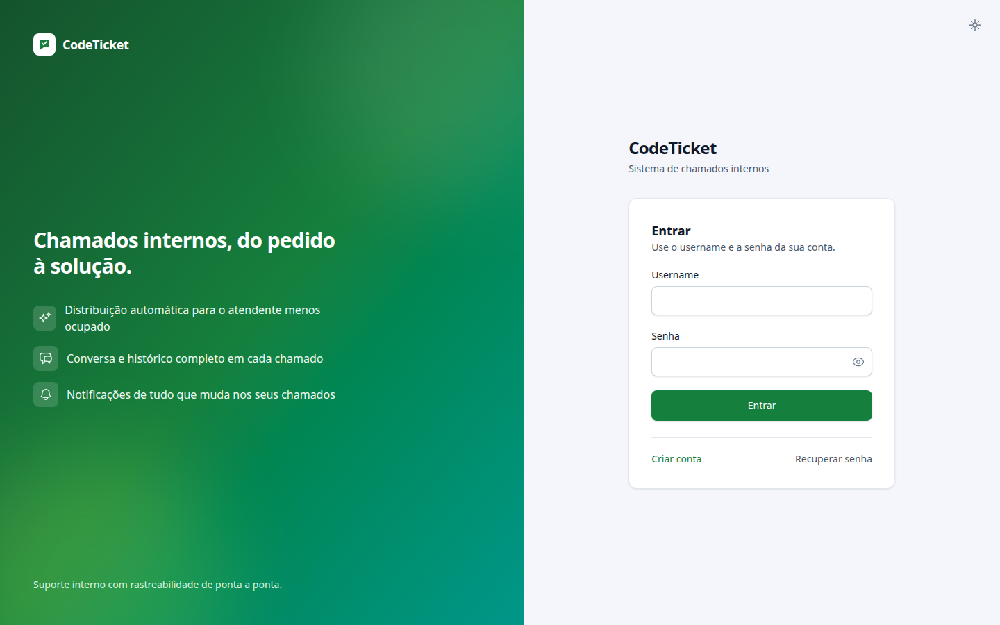
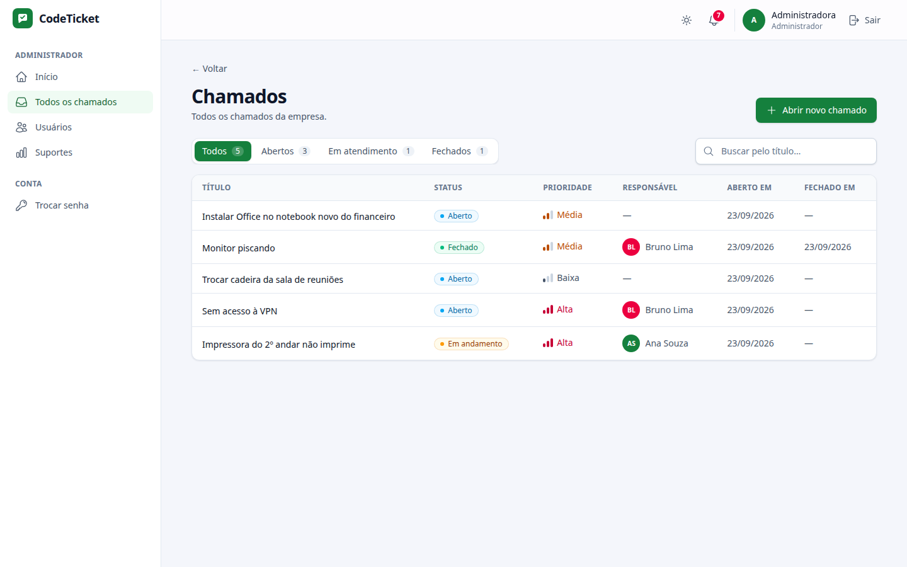
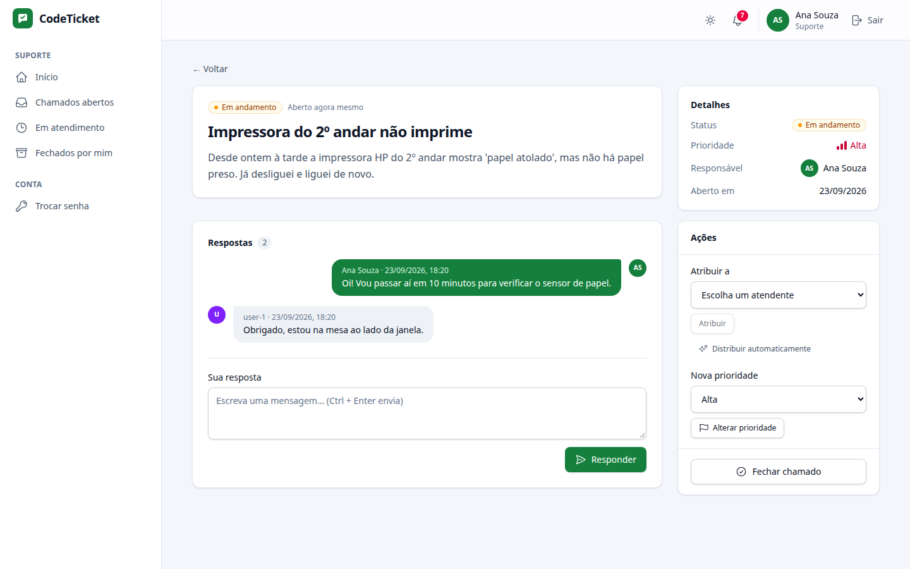
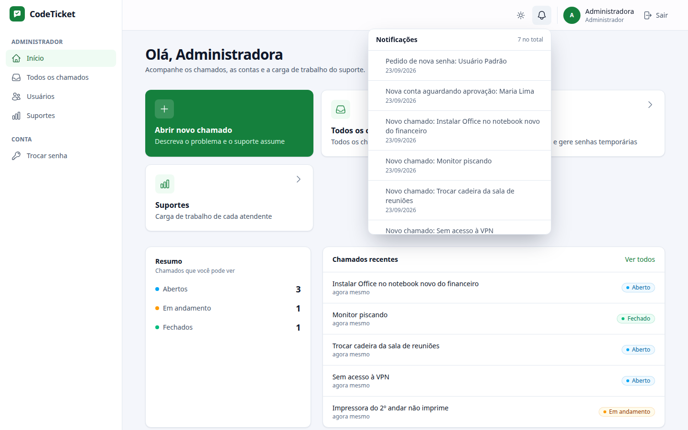
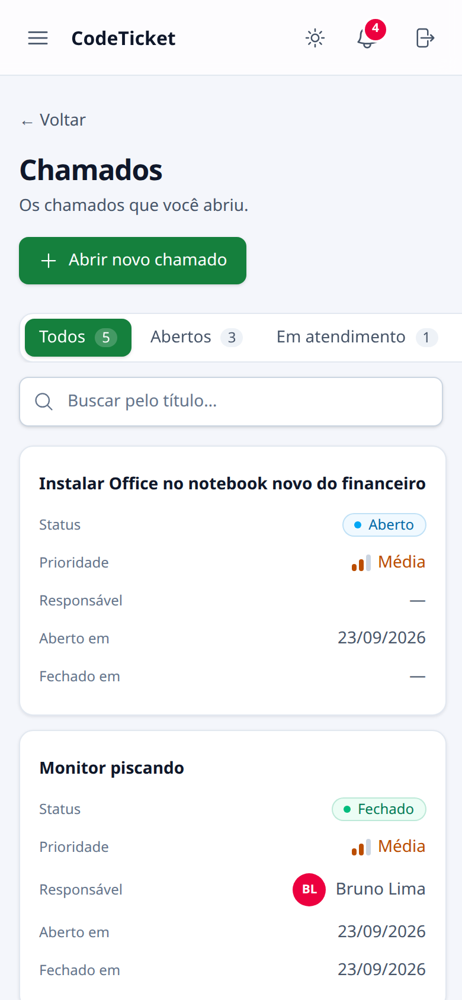
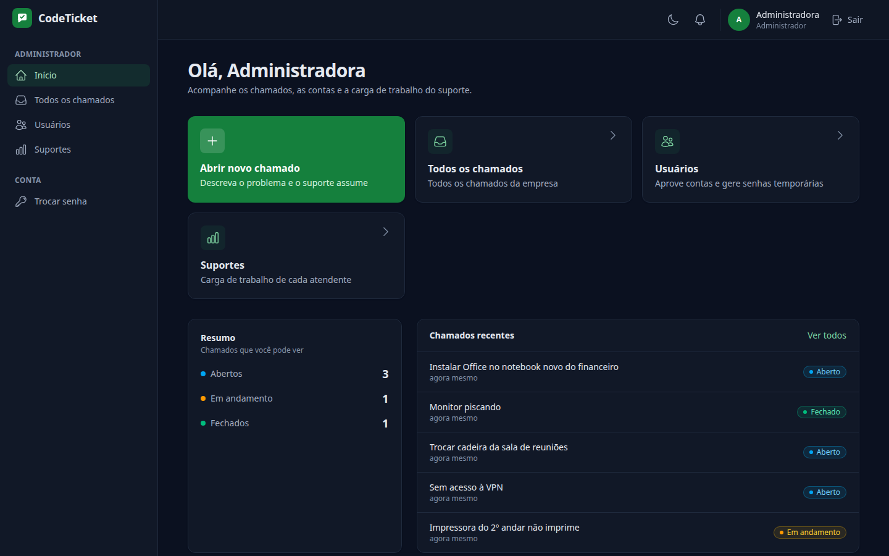

# CodeTicket — Sistema de Controle de Chamados Internos

Sistema para que funcionários de uma empresa abram chamados internos de suporte, e para que o time de suporte os acompanhe, atenda e distribua entre si.

> O projeto se chamava **Sys-Called**. A interface já usa o nome **CodeTicket**; os identificadores técnicos (módulo Go, binário `sys-called`, imagem Docker, chart Helm, projeto do compose) continuam com o nome antigo.

O backend é um **monólito modular** em Go: um único binário (e uma única imagem Docker, que também serve o frontend Vue) dividido em módulos com fronteiras garantidas pelo compilador e por testes de arquitetura. Neste README explico como rodar o projeto, a arquitetura, a infraestrutura, o CI/CD e os trade-offs que assumi.

## Telas

| Login | Lista de chamados |
| --- | --- |
|  |  |
| **Detalhe do chamado (suporte)** | **Notificações (administrador)** |
|  |  |
| **Celular** | **Tema escuro** |
|  |  |

## Como executar

### Dependências

- Docker e Docker Compose — é tudo que é preciso pra rodar o projeto inteiro.
- Opcionalmente, Go 1.26+ e Node 22+ (24 no CI) pra rodar fora de container.

### Docker Compose (recomendado)

```bash
make env     # cria o .env a partir do .env.example, com uma chave JWT nova
make up      # docker compose up --build -d --wait
make smoke   # opcional: exercita a stack de ponta a ponta
```

Abra **http://localhost:8000** e entre com um dos usuários de desenvolvimento (senha `senha123` pra todos):

| Username | Perfil | O que vê ao entrar |
|---|---|---|
| `usuario` | Usuário padrão | Abrir novo chamado, Meus chamados |
| `ana`, `bruno`, `carla` | Suporte | Chamados abertos, Em atendimento, Fechados por mim |
| `admin` | Administrador | Abrir novo chamado, Todos os chamados, Usuários, Suportes |

O compose sobe três coisas, cada uma só depois da anterior estar saudável:

| Serviço | O que faz |
|---|---|
| `postgres` | Um Postgres 16 só, com um schema por módulo (`employees`, `tickets`) |
| `migrate` | A própria imagem do app com `sys-called migrate`: aplica as migrações de todos os módulos e termina |
| `app` | O monólito: API em `/api`, frontend, `/healthz` e `/readyz` na porta 8000; métricas Prometheus em `127.0.0.1:9090` |

O container do app roda sem root, com sistema de arquivos só leitura, sem capabilities, com `no-new-privileges`, limite de memória, healthcheck e rotação de logs. `docker compose --profile observability up -d` sobe também um Prometheus em `127.0.0.1:9091` já coletando as métricas do app.

`make down` derruba a stack mantendo os dados; `docker compose down -v` apaga o volume do banco.

> Vindo de uma versão anterior (com `ticket-service`, `employees-service` e Kafka)? Rode `docker compose down -v --remove-orphans` antes: o banco agora é um só, com um schema por módulo.

### Deploy em AWS EC2

A aplicação também foi publicada em uma instância **Amazon EC2 Free Tier**, usando Ubuntu e Docker Compose. O deploy mantém a mesma arquitetura da stack local: um container para o monólito e um container para o PostgreSQL, com o Nginx na máquina EC2 fazendo o reverse proxy.

```text
Internet
   │
   │ HTTP :80
   ▼
 Nginx (EC2)
   │
   │ 127.0.0.1:8000
   ▼
 Docker Compose
   ├── app        → API Go + frontend Vue
   └── postgres   → PostgreSQL 16
```

Passos principais realizados na instância:

```bash
git clone https://github.com/FranciscoHonorat/Sistema-de-Chamados-Interno.git
cd Sistema-de-Chamados-Interno

make env
docker compose build
docker compose up -d
docker compose ps
```

Para manter a aplicação acessível somente através do Nginx, a porta do container foi vinculada ao loopback da EC2:

```yaml
ports:
  - "127.0.0.1:${APP_PORT:-8000}:8080"
```

O PostgreSQL também permanece restrito ao loopback:

```text
127.0.0.1:5433 → 5432
```

O Nginx recebe as requisições públicas na porta `80` e encaminha para `127.0.0.1:8000`:

```nginx
server {
    listen 80;
    listen [::]:80;

    server_name _;

    location / {
        proxy_pass http://127.0.0.1:8000;
        proxy_http_version 1.1;

        proxy_set_header Host $host;
        proxy_set_header X-Real-IP $remote_addr;
        proxy_set_header X-Forwarded-For $proxy_add_x_forwarded_for;
        proxy_set_header X-Forwarded-Proto $scheme;
    }
}
```

A configuração foi validada com:

```bash
sudo nginx -t
sudo systemctl restart nginx
sudo systemctl enable nginx

curl -I http://localhost
curl -I http://<IP-PUBLICO>
```

O retorno esperado é `HTTP/1.1 200 OK`.

No Security Group da EC2 foram liberadas as portas `80` (HTTP) e `443` (HTTPS). A porta `8000` não precisa ser liberada externamente, pois a aplicação fica disponível somente em `127.0.0.1:8000`.

A instância utilizada durante a documentação ficou acessível pelo endereço público:

```text
http://3.148.209.194
```

> O endereço IPv4 público de uma EC2 pode mudar quando a instância é parada e iniciada novamente. Para um endereço permanente, utilize um Elastic IP.

O ambiente também teve o **K3s** instalado para avaliar uma implantação Kubernetes com Helm. Como a aplicação foi mantida em Docker Compose nesta implantação, o serviço do K3s foi posteriormente desabilitado para evitar consumo desnecessário de memória na instância Free Tier:

```bash
sudo systemctl disable k3s
sudo systemctl stop k3s
```

#### Problemas comuns

| Sintoma | Causa e solução |
|---|---|
| `migrate` sai com código 255 e o log mostra `exec /usr/local/bin/sys-called: operation not permitted` | Em alguns hosts (visto com Docker 29 no kernel 7), **qualquer** container com `no-new-privileges` falha no `exec`; dá pra confirmar com `docker run --rm --security-opt no-new-privileges:true alpine true`. A solução definitiva é atualizar Docker/containerd/runc. Enquanto isso, ponha `NO_NEW_PRIVILEGES=false` no seu `.env` (o padrão é `true`; só afeta o compose local, o chart continua com `allowPrivilegeEscalation: false`) |
| `bind: address already in use` na 8000, 9090 ou 5433 | Outro processo usa a porta. Troque `APP_PORT` no `.env`, ou pare o que estiver nela (`docker ps` ajuda a achar) |

### Kubernetes local (kind + Helm)

```bash
make k8s-up      # cria o cluster kind, faz o build da imagem, carrega no cluster e instala o chart
make k8s-test    # helm test + smoke test contra http://localhost:30080
make k8s-deploy  # novo build e helm upgrade (rolling update sem indisponibilidade)
make k8s-down    # apaga o cluster
```

`IMAGE=repo:tag ./infra/scripts/k8s.sh up` instala uma imagem já pronta (é assim que o CI reaproveita a imagem que ele mesmo construiu).

### Rodando fora do Docker

```bash
make db-test        # Postgres descartável em localhost:55432
make dev-backend    # go run ./cmd/sys-called  → http://localhost:8080 (migra e cria os usuários de desenvolvimento)
make dev-frontend   # Vite em http://localhost:5173, com proxy de /api para o backend
```

Se a 8080 já estiver ocupada, suba o backend em outra porta e aponte o Vite pra ela:

```bash
PORT=8081 METRICS_PORT=9092 make dev-backend
BACKEND_URL=http://localhost:8081 make dev-frontend
```

Nesse modo o backend serve só a API. Pra rodar o smoke test contra ele, compile o frontend e passe o `dist/`: `cd frontend && npm run build`, depois `STATIC_DIR=$PWD/frontend/dist make dev-backend` e `./scripts/smoke-test.sh http://localhost:8080`.

### Configuração do app

Tudo por variável de ambiente, validado na subida (o app lista todos os problemas de uma vez e sai com código 2):

| Variável | Padrão | Para quê |
|---|---|---|
| `DATABASE_URL` | — (obrigatória) | Postgres. Cada módulo abre seu pool com `search_path` no próprio schema |
| `APP_ENV` | `development` (`production` na imagem) | Em produção o `JWT_PRIVATE_KEY` é obrigatório, os logs saem em JSON e os usuários de demonstração ficam desligados |
| `JWT_PRIVATE_KEY` | vazio | Chave Ed25519 (PKCS8 PEM) que assina os tokens. Vazia em desenvolvimento = chave efêmera |
| `PORT` / `METRICS_PORT` | `8080` / `9090` | HTTP do app / métricas Prometheus (porta separada, fora do Ingress) |
| `STATIC_DIR` | vazio (`/app/web` na imagem) | Onde está o build do frontend. Vazio = só API |
| `MIGRATE_ON_START` | `true` | Aplica as migrações na subida. O compose e o chart desligam e usam o `migrate` separado |
| `SEED_DEMO_USERS` | `true` fora de produção | Cria os usuários de desenvolvimento |
| `TICKETS_CACHE_ENABLED` | `true` | Cache de chamados em memória. Desligue com mais de uma réplica (o chart faz isso sozinho) |
| `DB_MAX_CONNS` | `10` | Conexões por pool (há um pool por módulo) |
| `LOG_LEVEL` / `LOG_FORMAT` | `info` / `text` (`json` em produção) | Logs estruturados (`log/slog`), com `request_id` em cada linha |
| `SHUTDOWN_TIMEOUT` | `15s` | Quanto tempo o app espera as requisições em andamento ao receber SIGTERM |

O binário tem quatro comandos: `serve` (padrão), `migrate`, `healthcheck [url]` (usado pelo `HEALTHCHECK` da imagem distroless, que não tem shell nem curl) e `version`.

### Comandos do `makefile`

`make help` lista todos. Os principais: `make setup` (instala as dependências), `make test` (Go + frontend), `make test-integration` (Go contra Postgres real), `make lint`, `make check` (o que o CI roda antes da integração), `make up`/`down`/`logs`/`smoke`, `make image`, `make helm-lint` e os `make k8s-*`.

`make lint-backend` (e portanto `make lint` e `make check`) precisa do `golangci-lint` v2: `go install github.com/golangci/golangci-lint/v2/cmd/golangci-lint@latest`. `make helm-lint` precisa do `helm`, e os `make k8s-*` do `kind` e do `helm`.

## Arquitetura: monólito modular

```
navegador ──HTTP──▶ sys-called (1 processo, 1 imagem)
                    │
                    ├─ platform/httpserver   /api/*, SPA, /healthz, /readyz, gzip, CSP, request id, logs
                    │
                    ├─ /api/employees ─▶ módulo employees   contas, sessões, JWT, outbox
                    │                         │   ▲
                    │          eventos (outbox │   │ contracts.TokenVerifier
                    │          → relay → bus)  ▼   │
                    ├─ /api/tickets ───▶ módulo tickets     chamados (event sourcing), atendentes, notificações
                    │
                    └─ Postgres: schema "employees" · schema "tickets"
```

A primeira versão eram dois serviços (`employees-service` e `ticket-service`), cada um com seu banco, conversando por Kafka, mais um nginx na frente. Pro tamanho do domínio, isso cobrava caro: quatro containers de infraestrutura, um broker pra operar, JWKS por HTTP entre os serviços e deploys coordenados. Transformei em um monólito modular mantendo o que a separação tinha de bom — fronteiras claras e comunicação assíncrona — e descartando o custo operacional. A decisão está registrada em [`docs/adr/0001-monolito-modular.md`](docs/adr/0001-monolito-modular.md).

### Módulos e fronteiras

Cada módulo é um pacote em `backend/modules/<nome>` com:

- **`module.go`** — a fachada: `New(...)` monta o módulo, `RegisterRoutes` pendura a API HTTP, `Migrations()` entrega o SQL embutido e `Schema` diz qual schema o módulo possui.
- **`contracts/`** (só no `employees`, que é consumido) — a *linguagem publicada* do módulo: os eventos de integração (`EmployeeRegistered`, `EmployeeSignedUp`, `PasswordResetRequested`) e a porta `TokenVerifier`. Só depende da biblioteca padrão.
- **`internal/`** — domínio, casos de uso e adaptadores, com a mesma arquitetura hexagonal de antes (`domain/`, `application/`, `adapters/in`, `adapters/out`).

As regras de dependência são garantidas em três níveis:

1. **Compilador Go** — tudo sob `modules/<m>/internal/` só pode ser importado de dentro de `modules/<m>/`. É impossível o `tickets` importar o domínio ou os repositórios do `employees`.
2. **[`backend/architecture_test.go`](backend/architecture_test.go)** — um módulo só fala com outro pelo pacote `contracts` (nunca pela fachada); `contracts` só usa a biblioteca padrão; `internal/platform` não conhece nenhum módulo.
3. **`modules/<m>/internal/architecture_test.go`** — dentro do módulo: domínio não depende de aplicação nem de adaptadores; aplicação não depende de adaptadores, de frameworks (Gin, pgx, JWT, Prometheus), da plataforma nem de outros módulos; um adaptador não importa outro.

Um teste de contrato (`modules/employees/contracts_test.go`) garante que os eventos de domínio gravados no outbox continuam decodificando nos structs publicados em `contracts`.

### Comunicação entre módulos

- **Síncrona, por porta**: o `tickets` precisa saber quem está chamando. Ele declara a porta `TokenVerifier` na sua camada de aplicação; o adaptador `adapters/out/employees` implementa essa porta usando o `contracts.TokenVerifier` que o `employees` oferece, e traduz o `Principal` para o `actor.Actor` do domínio de chamados (camada anticorrupção). Nada de HTTP entre os dois.
- **Assíncrona, por eventos com outbox**: o `employees` grava o funcionário e o evento na tabela `outbox_events` na **mesma transação**. Um relay publica os eventos pendentes no barramento em processo (`internal/platform/eventbus`), e o `tickets` assina `EmployeeRegistered` (mantém sua própria lista de atendentes) e os pedidos de conta (notificações para os administradores). A entrega é *at-least-once*: se um assinante falha, o evento continua pendente e é reenviado — os assinantes são idempotentes (cada mensagem leva o ID do evento do outbox, e a notificação de um pedido de conta usa um ID derivado dele, então uma reentrega não duplica nada). Um evento que falha não segura o resto do lote: os outros seguem, e ele volta quando o *lease* de 15s expira.
- **Várias réplicas**: o relay reserva os eventos com `FOR UPDATE SKIP LOCKED` e um *lease* de 15 segundos (`locked_until`), então duas réplicas nunca entregam o mesmo evento ao mesmo tempo, e uma réplica que morre no meio de um lote só segura os eventos até o lease expirar.

Como o contrato dos eventos é o mesmo que ia pelo Kafka (tipo + payload JSON), extrair um módulo para um serviço no futuro é trocar o `eventbus` por um broker e o `TokenVerifier` em processo por um verificador JWKS — o domínio e os casos de uso não mudam.

### Plataforma compartilhada (`backend/internal/platform`)

| Pacote | Responsabilidade |
|---|---|
| `config` | Lê e valida o ambiente, com todos os erros de uma vez |
| `database` | Abre um pool por módulo com `search_path` no schema do módulo e espera o banco ficar disponível (backoff exponencial) |
| `migrate` | Aplica as migrações embutidas no binário (`embed.FS`), por schema, com histórico em `<schema>.schema_migrations` e um *advisory lock* do Postgres — várias réplicas subindo juntas aplicam cada arquivo uma vez só |
| `eventbus` | Barramento em processo; um assinante que falha ou entra em pânico vira erro, sem derrubar os outros |
| `httpserver` | Gin + middlewares (request id, recuperação de pânico, access log, métricas por rota, cabeçalhos de segurança/CSP/HSTS, limite de 1 MB no corpo, gzip), `/healthz` (liveness), `/readyz` (readiness, pinga o banco), SPA com cache imutável dos assets, e o servidor de métricas numa porta separada. Desligamento gracioso |
| `logging` | `log/slog` em texto ou JSON |
| `database/dbtest` | Pool migrado para os testes de integração |

A composição fica em `backend/internal/app` (monta a plataforma e os módulos, e liga um ao outro) e `backend/cmd/sys-called` (comandos do binário).

### Por dentro de cada módulo

Continua a arquitetura hexagonal da versão anterior: **Event Sourcing** no `tickets` (cada chamado é a sequência dos seus eventos, com quem executou cada ação — trilha de auditoria completa), **DDD tático** (agregados, value objects, políticas de permissão e visibilidade no próprio agregado), **CQRS leve** (`command/` e `query/`) e **TDD** em todo o código.

### Autenticação e autorização

A autenticação fica no módulo `employees`, e o módulo `tickets` só valida os tokens, pelo contrato público que o `employees` expõe:

- **Senhas** guardadas com bcrypt. Login com usuário inexistente e com senha errada respondem igual (`401 invalid credentials`) e levam o mesmo tempo — no caso do usuário inexistente comparo a senha contra um hash fictício, pra não dar pra descobrir quais usernames existem medindo o tempo de resposta.
- **Access token JWT de 15 minutos**, assinado com **Ed25519 (EdDSA)**. A assinatura assimétrica continua útil no monólito: a chave pública é publicada no JWKS, então qualquer serviço extraído no futuro (ou um gateway) valida os tokens sem conhecer a chave privada. O token carrega `sub` (id do funcionário), `name`, `role`, `must_change_password`, `iss`, `aud` e `exp`, e o cabeçalho leva o `kid` da chave.
- **Validação em processo**: o módulo `tickets` recebe um `contracts.TokenVerifier` do `employees` e o adapta ao seu próprio ator de domínio (camada anticorrupção em `adapters/out/employees`). O verificador exige `EdDSA` explicitamente (o que fecha o ataque clássico de "confusão de algoritmo" com HS256), além de emissor, audiência e expiração. O JWKS continua publicado em `GET /api/employees/.well-known/jwks.json`.
- **Refresh token opaco de 7 dias**, com **rotação a cada uso** e **detecção de reuso**: cada refresh gera um token novo e revoga o anterior; se um token já revogado for apresentado de novo (sinal de que foi roubado), todas as sessões daquele funcionário são revogadas. A exceção é um token trocado por um refresh há no máximo **10 segundos**: ele ainda gera uma sessão nova, porque duas abas renovando ao mesmo tempo com o mesmo cookie não são um roubo (sem isso, a aba que perdesse a corrida apagaria o cookie da outra e o usuário cairia das duas). Logout e "revogar todas" fecham essa janela na hora. No banco fica só o hash SHA-256 do refresh token.
- **No navegador**, o access token fica só em memória (nunca em `localStorage`, que um XSS conseguiria ler) e o refresh token fica num cookie `HttpOnly; Secure; SameSite=Strict`, restrito ao caminho `/api/employees/auth`. Quando a página é recarregada, o frontend recupera a sessão chamando o refresh; quando o access token expira no meio do uso, o cliente da API renova a sessão uma vez e repete a chamada.

- **Contas.** Qualquer pessoa pode criar uma conta, sempre com perfil de usuário padrão (só o administrador define quem é suporte ou administrador). A conta nasce **aguardando aprovação**: o login responde `403` com uma mensagem clara até o administrador aprovar. Senhas precisam ter pelo menos 8 caracteres.
- **Esqueci a senha.** Sem servidor de e-mail, o pedido vai pro administrador: ele recebe uma notificação e gera uma **senha temporária**, que aparece uma única vez na tela pra ele entregar pessoalmente. Quem entra com uma senha temporária é levado direto pra tela de troca de senha e não sai dela até escolher uma nova — e o servidor também garante isso: enquanto a troca não acontece, toda rota autenticada, fora `POST /auth/change-password`, responde `403`. O pedido responde sempre `202`, exista o username ou não, pra não revelar quais usernames existem.
- **Notificações.** O módulo `employees` grava `EmployeeSignedUp` e `PasswordResetRequested` no outbox; o relay entrega no barramento de eventos em processo, e o módulo `tickets` grava notificações pros administradores, junto com as notificações de chamados. O frontend consulta a cada 30 segundos.

A autorização dos chamados fica no módulo `tickets`, como regra de domínio:

| Perfil | Vê | Pode |
|---|---|---|
| Usuário | só os chamados que ele abriu | abrir chamado, responder; editar os seus só enquanto ninguém começou o atendimento |
| Suporte | os chamados abertos e os atribuídos a ele (inclusive os que ele fechou) | atribuir (a si ou a outro), distribuir automaticamente, mudar prioridade, responder; iniciar e fechar os atribuídos a ele |
| Administrador | todos | editar, atribuir, distribuir automaticamente, mudar prioridade, responder — **não** inicia nem fecha chamados, isso é trabalho do suporte responsável |

Um chamado que o ator não pode ver responde **404, igual a um chamado inexistente** — assim a API não revela que ele existe. Se ele pode ver mas não pode fazer a ação, a resposta é **403**. O autor de cada resposta é sempre quem está autenticado, nunca um campo enviado no corpo da requisição.


## Frontend

Vue 3 + Vite + TypeScript, Vue Router e Tailwind CSS 4, servido pelo próprio binário Go na mesma origem da API (o cookie `SameSite=Strict` funciona sem CORS).

O que mudou na interface:

- **Design system próprio**: tokens semânticos de cor (superfície, texto, bordas, marca) que trocam no **tema escuro**. A marca é verde (`--color-brand-*` em `frontend/src/style.css`; `brand-600` = `#15803d`, contraste 5:1 com texto branco), distinta do verde-esmeralda usado para sucesso e chamados fechados; o tema segue o sistema por padrão e pode ser fixado pelo botão do cabeçalho (lembrado no navegador e aplicado antes da primeira pintura, sem "piscar").
- **Layout responsivo de verdade**: barra lateral com o menu do perfil no desktop, menu em gaveta no celular; tabelas que viram **cartões** em telas pequenas; modais que viram *bottom sheet* no celular; detalhe do chamado em duas colunas no desktop (conversa + painel de detalhes e ações).
- **Estados de tela completos**: esqueletos de carregamento, estados vazios, erro com "Tentar novamente", botões com indicador de progresso e bloqueio de clique duplo, e *toasts* confirmando cada ação.
- **Mais contexto**: início com resumo dos chamados visíveis e os mais recentes; lista com contadores por situação e busca pelo título; badges de status e prioridade; conversa em formato de chat; carga de trabalho de cada atendente com barras; datas relativas ("há 5 minutos").
- **Acessibilidade**: link "Pular para o conteúdo", foco preso e devolvido nos modais, `aria-current` no menu, `aria-invalid`/`aria-describedby` nos campos, respeito a `prefers-reduced-motion`, rótulos em todos os botões de ícone. Os testes (Vitest + Testing Library) continuam consultando a tela por papel e rótulo, como um leitor de tela.
- Página 404, título da aba por página, favicon e metadados.

## Infraestrutura

### AWS EC2

A implantação de demonstração foi feita em uma única instância Amazon EC2 Free Tier com Ubuntu. O acesso público passa pelo Nginx na porta `80`, enquanto a aplicação e o PostgreSQL ficam restritos ao próprio host.

```text
EC2
├── Nginx :80
│    └── proxy → 127.0.0.1:8000
│
└── Docker Compose
     ├── app :8080
     └── postgres :5432
          └── volume postgres_data
```

Essa configuração é adequada para demonstração, avaliação acadêmica e portfólio, mas não representa uma arquitetura de alta disponibilidade. O PostgreSQL utilizado na EC2 fica associado ao armazenamento da própria instância e não possui, nesta implantação, backup externo ou failover automático.

### Imagem

Um `Dockerfile` multi-stage na raiz: build do frontend (Node), build do Go com `-trimpath` e versão/commit embutidos, e imagem final **distroless `static:nonroot`** (~45 MB) com o binário e o `dist/` do frontend. Os estágios de build rodam na plataforma da máquina e o Go faz cross-compile, então o build multi-arquitetura (amd64 + arm64) não precisa de emulação. O `HEALTHCHECK` usa o próprio binário.

### Helm chart ([`infra/helm/sys-called`](infra/helm/sys-called))

| Recurso | Detalhes |
|---|---|
| Deployment do app | Init container `migrate` antes de cada versão; *startup*, *readiness* (`/readyz`) e *liveness* (`/healthz`) separados; `preStop` para drenar sem erro; rolling update com `maxUnavailable: 0`; pods sem root, sem capabilities, `seccomp: RuntimeDefault`, raiz só leitura, sem token de service account; `topologySpreadConstraints` entre nós; imagem por tag ou **por digest** |
| HPA / PDB | Autoescala por CPU opcional; PodDisruptionBudget sempre que puder haver mais de uma réplica |
| Postgres | StatefulSet com volume persistente (desligável com `postgresql.enabled=false` para usar um banco gerenciado via `externalDatabase.existingSecret`) |
| Secret | Senha do banco e chave Ed25519 geradas na primeira instalação, reaproveitadas nos upgrades (`lookup`) e mantidas no uninstall; ou `secrets.existingSecret` para Sealed/External Secrets |
| Rede | NetworkPolicy: só o app fala com o Postgres |
| Exposição | Service ClusterIP (NodePort no kind), Ingress com TLS opcional (ex.: cert-manager) |
| Observabilidade | Porta de métricas no Service e `ServiceMonitor` opcional (Prometheus Operator) |
| `helm test` | Pod que checa o `/readyz` pelo Service |

Os arquivos de valores: `values.yaml` (padrões de produção: sem usuários de demonstração, 2 réplicas, NetworkPolicy), `values-dev.yaml` (kind local), `values-staging.yaml` e `values-production.yaml` (banco gerenciado, HPA, Ingress com TLS, ServiceMonitor). Com mais de uma réplica o chart desliga sozinho o cache de chamados em memória.

## CI/CD

### CI — [`.github/workflows/ci.yml`](.github/workflows/ci.yml)

Roda em todo PR e em todo push na `main` e em tags `v*`. Em PR, um push novo cancela a execução anterior.

| Job | O que faz |
|---|---|
| Backend · lint, unit tests | `go mod tidy` sem diff; **golangci-lint** (errcheck, govet, staticcheck, gosec, errorlint, bodyclose, noctx…, mais gofmt/goimports); testes unitários, de arquitetura e de fronteira entre módulos com `-race` e cobertura |
| Backend · integration | Postgres como service container: migrações, repositórios, lease do outbox e o **app inteiro por HTTP** (`internal/app/app_test.go`: login, eventos chegando de um módulo no outro, abertura e distribuição de chamado, SPA) |
| Backend · vulnerabilities | `govulncheck` |
| Frontend | `npm ci`, **ESLint**, type-check (`vue-tsc`), testes com cobertura, build e `npm audit` das dependências de produção |
| E2E · Playwright | Postgres como service container, build do frontend, o binário servindo o `dist/` e os testes E2E de `frontend/e2e` no Chromium; guarda o relatório do Playwright quando algo falha |
| Image · build and scan | Build com cache do GitHub Actions, checa que o binário sobe, **Trivy** (relatório SARIF no *code scanning*; falha em CRITICAL/HIGH com correção disponível) e guarda a imagem como artefato |
| Helm chart and scripts | `helm lint` e `helm template` com todos os arquivos de valores, validação dos manifestos com **kubeconform** e **shellcheck** |
| Smoke · Docker Compose | Sobe a stack com a imagem do job anterior e roda [`scripts/smoke-test.sh`](scripts/smoke-test.sh); reinicia o app e roda de novo (sessões e dados sobrevivem) |
| Smoke · Kubernetes | Cluster kind no runner, `helm install` com a mesma imagem, `helm test`, smoke test e um *rolling upgrade* verificado |
| Release | Só em `main` e tags, e só se **tudo** acima passou: chama o CD |

Além dele, [`codeql.yml`](.github/workflows/codeql.yml) analisa Go e TypeScript (em PR, na `main` e semanalmente) e o [`dependabot.yml`](.github/dependabot.yml) mantém atualizados Go, npm, imagens do Dockerfile e do compose e as próprias Actions.

### CD — [`release.yml`](.github/workflows/release.yml) e [`deploy.yml`](.github/workflows/deploy.yml)

```
push na main ──▶ CI verde ──▶ imagem ghcr.io/<dono>/sys-called:{edge, sha-…} ──▶ deploy staging ──▶ helm test + smoke test completo
tag v1.2.3   ──▶ CI verde ──▶ imagem :{1.2.3, 1.2} + chart OCI 1.2.3 + GitHub Release ──▶ (aprovação) deploy production ──▶ helm test + smoke test somente leitura
```

- **Imagem**: multi-arquitetura (amd64 + arm64), com SBOM e *provenance* (SLSA) anexados, atestado de build do GitHub e **assinatura keyless com cosign** (OIDC do GitHub, sem chave para guardar).
- **Chart**: empacotado com a versão da tag e publicado como OCI em `oci://ghcr.io/<dono>/charts/sys-called`.
- **Release**: notas geradas a partir dos PRs, com a imagem, o digest, o comando de instalação e o de verificação da assinatura.
- **Deploy** (workflow reutilizável, um por ambiente, nunca dois ao mesmo tempo no mesmo ambiente): verifica a assinatura da imagem, faz `helm upgrade --install --atomic` **pelo digest** (o exato artefato que o CI testou), roda `helm test` e o smoke test contra a URL pública, e faz **rollback automático** se algo falhar depois do rollout (o `--atomic` já desfaz um rollout que falha).

Para ligar os deploys: crie os *environments* `staging` e `production` no GitHub (em produção, com *required reviewers* para a aprovação manual), cadastre em cada um o secret `KUBECONFIG` (kubeconfig em base64 com permissão no namespace) e as variáveis `APP_URL` e, opcionalmente, `KUBE_NAMESPACE`, e defina a variável de repositório `DEPLOY_ENABLED=true`. Sem isso, o pipeline publica imagem, chart e release e pula os deploys. Para o smoke test de staging logar com outra conta que não a de demonstração, use os secrets `SMOKE_USERNAME`/`SMOKE_PASSWORD`.

## Como atendi cada requisito do desafio

### 2.0 — Cadastro de chamados

Pela interface: abrir (tela "Abrir novo chamado"), editar (botão "Editar" no detalhe), listar (lista de chamados) e visualizar (detalhe). Pela API: `POST /api/tickets/tickets`, `PUT /api/tickets/tickets/:id`, `GET /api/tickets/tickets` e `GET /api/tickets/tickets/:id`. Cada chamado tem título, descrição, prioridade (baixa/média/alta), status (aberto/em andamento/fechado), responsável e data/hora de abertura — os campos mínimos pedidos, mais quem abriu o chamado e o histórico de respostas trocadas, que achei natural pro caso de uso.

### 3.0 — Responsáveis pelo atendimento

Segui a sugestão do enunciado de não construir um cadastro completo: o módulo `employees` sobe com três atendentes (`ana`, `bruno`, `carla`), além de um administrador e um usuário padrão (só em desenvolvimento; em produção os usuários de demonstração ficam desligados). Funcionários são um módulo próprio, com schema próprio, porque são outro domínio. Os atendentes aparecem pelo nome no seletor "Atribuir a" do detalhe do chamado.

### 4.0 — Distribuição automática

O botão "Distribuir automaticamente" (`POST /api/tickets/tickets/:id/assign/auto`) atribui o chamado ao atendente com menos chamados em aberto; a atribuição manual continua disponível. Defini "em aberto" como qualquer chamado com status diferente de fechado — ou seja, aberto e em andamento contam como carga de trabalho — porque é o que reflete trabalho pendente de verdade pra quem está atendendo.

### 5.0 — Listagem e acompanhamento

A lista mostra título, status, prioridade, responsável e data de abertura, com filtro por status. Como cada perfil já recebe do backend só o que pode ver, a mesma tela serve de "Meus chamados" pro usuário, de "Todos os chamados" pro administrador e de "Chamados abertos / Em atendimento / Fechados por mim" pro suporte.

### 6.0 — Funcionamento da aplicação

`make env` seguido de `docker compose up --build` sobe tudo (Postgres, migrações e o app com o frontend), com usuários de desenvolvimento prontos — detalhado no topo deste README.

## Testes

```bash
make test               # unitários, arquitetura e fronteiras (Go, com -race) + frontend — sem dependências externas
make db-test            # Postgres descartável na porta 55432
make test-integration   # tudo acima + integração contra o Postgres
make up && make test-e2e   # E2E com Playwright contra a stack no ar (E2E_BASE_URL muda o alvo)
```

Os testes E2E (`frontend/e2e`, Playwright) usam o app de verdade, no navegador, com os usuários de desenvolvimento: login e erros de login, a home de cada perfil, o bloqueio de área de outro perfil, logout, sessão que sobrevive ao recarregar, criação de conta com aprovação do administrador (e a notificação que ele recebe), o ciclo completo de um chamado entre os três perfis (abrir, atribuir, iniciar, conversar, fechar com relatório), distribuição automática, validação do formulário, busca, ações escondidas de quem não é suporte, tema que persiste e o menu em gaveta no celular. Cada teste cria os próprios dados com nomes únicos, então rodam em paralelo e podem rodar de novo contra o mesmo banco. No CI eles têm um job próprio, que sobe um Postgres, compila o frontend, sobe o binário servindo o `dist/` e guarda o relatório do Playwright quando algo falha.

Os testes de integração ficam atrás de `SYS_CALLED_TEST_DATABASE_URL`: sem ela, são pulados. Eles criam e migram os schemas sozinhos (`dbtest.Pool`) e usam IDs únicos por execução. Rode com `-p 1` (o `make` já faz isso): o teste do app inteiro liga um relay do outbox, que disputaria os eventos com os testes do próprio outbox.

| Camada | Onde |
|---|---|
| Domínio e casos de uso | `modules/*/internal/domain`, `.../application` (com fakes das portas em `port/out/outtest`) |
| Arquitetura | `backend/architecture_test.go` (entre módulos) e `modules/*/internal/architecture_test.go` (camadas) |
| Contratos | `modules/employees/contracts_test.go` |
| Adaptadores | HTTP (`httptest`), barramento, Postgres (integração) |
| Plataforma | configuração, barramento, servidor HTTP (probes, SPA, cabeçalhos, gzip, pânico) |
| App inteiro | `internal/app/app_test.go` (integração, por HTTP) |
| Frontend | Vitest + Testing Library, por papel e rótulo (cobertura ~94% das linhas) |
| Ponta a ponta | `scripts/smoke-test.sh` contra o compose, o kind e os ambientes do CD |
| E2E no navegador | `frontend/e2e` (Playwright, desktop e celular) |

## Trade-offs e o que ficou de fora

- **Um processo, uma falha em comum**: um bug que derrube o processo derruba os dois módulos. É o preço do monólito; em troca, não há rede entre os módulos, nem broker, nem deploy coordenado. As réplicas e o PDB cuidam da disponibilidade.
- **Barramento síncrono dentro do relay**: os eventos são entregues pelo relay do outbox (1 s de intervalo), não na mesma transação da requisição — a consistência entre módulos é eventual, como era com o Kafka, só que mais rápida.
- **Um evento com assinante quebrado segura os seguintes**: o relay para no primeiro erro pra preservar a ordem dos eventos (e tenta de novo). Uma fila de mensagens mortas depois de N tentativas seria o próximo passo.
- **Cache de chamados por instância**: com uma réplica ele fica ligado; com mais, o chart o desliga e cada leitura reidrata o chamado dos eventos. A lista, a distribuição automática e a carga dos atendentes carregam os eventos de todos os chamados que faltam no cache numa **única consulta** (`LoadMany`, com `aggregate_id = ANY(...)`), então são duas idas ao banco, não uma por chamado; o que continua proporcional ao número de chamados é o trabalho de reconstruí-los em memória. Uma projeção de leitura (tabela atualizada pelos eventos) resolveria as duas coisas e também levaria o filtro da lista para o banco.
- **Nomes de quem não é atendente**: o módulo `tickets` só conhece por nome os atendentes (pelos eventos). Na conversa, o próprio usuário aparece pelo nome; os demais não atendentes, pelo id. Publicar os nomes de todos os funcionários como evento resolveria.
- **A recuperação de senha passa pelo administrador**, não por e-mail; **notificações por consulta a cada 30 s**, não em tempo real (SSE seria o próximo passo); **perfil de funcionário não muda pela tela**.
- **Um access token vale até expirar (15 min)** mesmo depois do logout; o refresh token é revogado na hora.
- **O Postgres do chart é de um nó só**, sem backup: para produção, `values-production.yaml` já aponta para um banco gerenciado. Os ambientes `staging`/`production` do CD precisam ser configurados (ver CI/CD).

## Bibliotecas e referências externas

Backend (Go): [Gin](https://github.com/gin-gonic/gin), [pgx/v5](https://github.com/jackc/pgx), [golang-jwt/jwt v5](https://github.com/golang-jwt/jwt), [x/crypto/bcrypt](https://pkg.go.dev/golang.org/x/crypto/bcrypt), [google/uuid](https://github.com/google/uuid), [prometheus/client_golang](https://github.com/prometheus/client_golang), [klauspost/compress (gzhttp)](https://github.com/klauspost/compress), [testify](https://github.com/stretchr/testify).

Frontend: [Vue 3](https://vuejs.org/), [Vue Router](https://router.vuejs.org/), [Vite](https://vite.dev/), [Tailwind CSS 4](https://tailwindcss.com/), [Vitest](https://vitest.dev/), [Testing Library](https://testing-library.com/), [ESLint](https://eslint.org/) com [eslint-plugin-vue](https://eslint.vuejs.org/) e [typescript-eslint](https://typescript-eslint.io/). Ícones no estilo [Heroicons](https://heroicons.com/), embutidos como SVG.

Imagens: `node:24-alpine` e `golang:1.26-alpine` (build), `gcr.io/distroless/static-debian12:nonroot` (execução), `postgres:16-alpine`, `prom/prometheus` (perfil opcional).

## Referência de API

Todas as rotas ficam sob `/api/<módulo>`. Fora delas: `GET /healthz` (liveness), `GET /readyz` (readiness) e, na porta de métricas, `GET /metrics`.

### Módulo `employees` — `/api/employees`

| Método | Rota | Descrição |
|---|---|---|
| `POST` | `/auth/login` | Login (`{"username", "password"}`). Devolve o access token e grava o refresh token em cookie |
| `POST` | `/auth/refresh` | Troca o cookie de refresh por uma sessão nova (rotação) |
| `POST` | `/auth/logout` | Revoga a sessão e apaga o cookie |
| `GET` | `/.well-known/jwks.json` | Chaves públicas pra validar os tokens |
| `POST` | `/auth/signup` | Cria uma conta de usuário padrão aguardando aprovação (`{"name", "username", "password"}`). `409` se o username já existe, `400` se a senha tiver menos de 8 caracteres |
| `POST` | `/auth/password-reset-requests` | Pede ao administrador uma senha nova (`{"username"}`). Responde sempre `202` |
| `POST` | `/auth/change-password` | Troca a senha de quem está autenticado (`{"current_password", "new_password"}`) |
| `GET` | `/employees` | Lista os funcionários com perfil e situação (só administrador) |
| `POST` | `/employees/:id/approve` | Aprova uma conta (só administrador) |
| `POST` | `/employees/:id/temporary-password` | Gera uma senha temporária e devolve `{"temporary_password"}` uma única vez (só administrador) |

### Módulo `tickets` — `/api/tickets`

Todas as rotas exigem `Authorization: Bearer <access token>` e respeitam a tabela de perfis acima.

| Método | Rota | Descrição |
|---|---|---|
| `POST` | `/tickets` | Abre um chamado (`{"title", "description", "priority"}`; suporte e administrador podem mandar `assignee_id`, que precisa ser um atendente do suporte) |
| `GET` | `/tickets` | Lista os chamados que o usuário pode ver |
| `GET` | `/tickets/:id` | Detalhe de um chamado, com as respostas |
| `PUT` | `/tickets/:id` | Edita título/descrição |
| `POST` | `/tickets/:id/assign` | Atribui manualmente (`{"assignee_id"}`). `400` se o `assignee_id` não for um atendente do suporte |
| `POST` | `/tickets/:id/assign/auto` | Atribui ao atendente menos ocupado |
| `POST` | `/tickets/:id/priority` | Muda a prioridade (`{"priority": "Low\|Medium\|High"}`) |
| `POST` | `/tickets/:id/start` | Move para "em andamento" |
| `POST` | `/tickets/:id/close` | Fecha o chamado com o relatório do que foi feito (`{"resolution"}`, obrigatório) |
| `POST` | `/tickets/:id/responses` | Adiciona uma resposta (`{"content"}`); o autor é quem está autenticado |
| `GET` | `/responsibles` | Lista os atendentes com nome |
| `GET` | `/responsibles/workload` | Quantidade de chamados abertos, em andamento e fechados por atendente (só administrador) |
| `GET` | `/notifications` | Notificações de quem está autenticado, com o número de não lidas |
| `POST` | `/notifications/read` | Marca as notificações como lidas |

## Estrutura do repositório

```
backend/                         # módulo Go único: github.com/franciscoHonorat/Sys-Called/backend
  cmd/sys-called/                # o binário: serve | migrate | healthcheck | version
  internal/
    app/                         # composição: plataforma + módulos + ligações entre eles
    platform/                    # config, database (+dbtest), migrate, eventbus, httpserver, logging
  modules/
    employees/
      module.go                  # fachada do módulo (New, RegisterRoutes, Migrations, Schema)
      contracts/                 # linguagem publicada: eventos e TokenVerifier
      internal/                  # domain / application / adapters (+ migrations/*.sql embutidas)
    tickets/
      module.go
      internal/                  # domain / application (command, query, auth) / adapters
  architecture_test.go           # fronteiras entre módulos
frontend/
  src/
    components/ui/               # design system: botões, badges, ícones, alertas, esqueletos, avatares
    components/                  # shell (menu, cabeçalho, gaveta), modais, formulários, ações do chamado
    views/                       # telas (cada uma com seu .spec.ts)
    composables/                 # carregamento, polling, tema, toasts
    auth/ tickets/ employees/ router/
infra/
  helm/sys-called/               # chart (+ values-dev/staging/production)
  kind/cluster.yaml
  observability/prometheus.yml
  scripts/k8s.sh
scripts/smoke-test.sh            # teste de ponta a ponta usado no compose, no kind e no CD
docs/adr/                        # decisões de arquitetura
.github/workflows/               # ci, release, deploy, codeql
Dockerfile · docker-compose.yml · makefile · .env.example
```